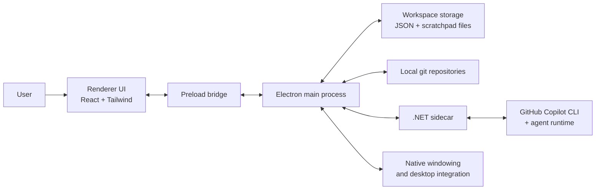
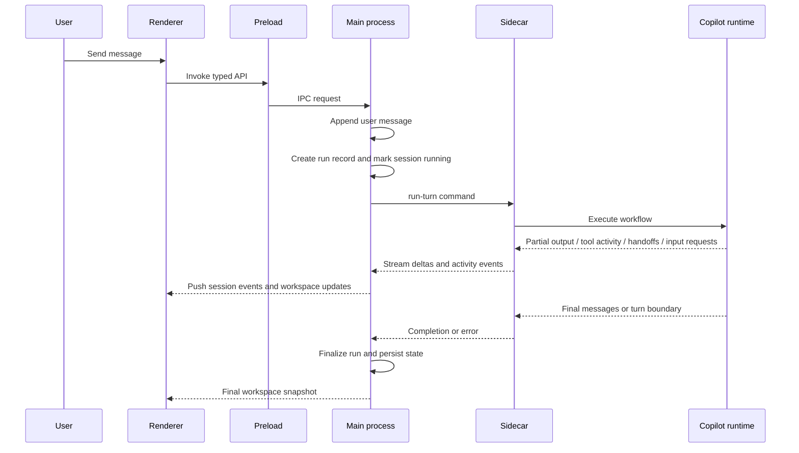

# Architecture

## What this system is

Eryx is a desktop workspace for Copilot-powered development work. It combines a persistent session model, project-aware context, reusable multi-agent orchestration patterns, optional external tooling, and live run visibility inside a single Electron application.

At a high level, the architecture is built around one core idea:

> keep the UI safe and responsive, keep application state centralized, and keep AI execution isolated in its own runtime.

That produces a system with clear boundaries:

- the **renderer** owns presentation and user interaction
- the **Electron main process** owns state mutation, persistence, OS integration, and process management
- the **sidecar** owns Copilot-backed execution and orchestration
- **shared contracts and domain models** keep all boundaries typed and explicit

## Design goals

The current architecture optimizes for:

- **safe desktop boundaries** between UI code and privileged capabilities
- **persistent workspaces** rather than disposable chat threads
- **project-aware execution** with repository context and optional tooling
- **observable AI runs** with streamed output, activity, and history
- **extensible orchestration** so patterns, models, and tool integrations can evolve without collapsing boundaries

## System context

## Runtime boundaries

| Boundary | Owns | Does not own | Communicates through |
| --- | --- | --- | --- |
| Renderer | Screens, interaction, local view composition, theme application | Filesystem, process spawning, raw Electron access, Copilot runtime | Typed preload API and pushed events |
| Preload | Narrow bridge between browser context and Electron IPC | Business logic, persistence, orchestration | `ipcRenderer` / `ipcMain` |
| Main process | Workspace mutation, persistence, git inspection, session lifecycle, native window state, sidecar lifecycle | UI rendering, LLM orchestration internals | IPC, filesystem, git CLI, stdio with sidecar |
| Sidecar | Capability discovery, pattern validation, run execution, streaming deltas and activity | UI, workspace persistence, Electron APIs | Line-delimited JSON over stdio |
| External systems | Git data, Copilot account/model access, OS window chrome | Application state and UI behavior | Controlled adapters owned by main or sidecar |

This split is the most important architectural feature in the app. It is what keeps the system understandable as more capabilities are added.

## High-level runtime model

Eryx runs as a multi-process desktop application:

1. The **renderer** displays the workspace and captures user intent.
2. The **preload bridge** exposes a small, typed API into the browser context.
3. The **main process** validates and mutates application state, persists it, and manages native integrations.
4. The **sidecar** executes Copilot-backed turns and streams structured execution events back.

The sidecar is intentionally separate from the Electron main process so that AI runtime concerns stay isolated from UI and persistence concerns.

## Main user flow

The most important end-to-end interaction is sending a message in a session.

This flow is important because it shows that Eryx is not architected as a simple "send prompt, get string" application. It treats execution as a structured, observable process.

## Application state model

The durable state of the app is a **workspace**. The workspace contains:

- connected projects
- orchestration patterns
- sessions
- settings
- run history

This gives Eryx a persistent operating model rather than a transient chat model.

### Projects

Projects are the container for context. There are two kinds:

- a special **scratchpad** project for lightweight work
- normal **project-backed** entries pointing at local folders

The scratchpad is modeled inside the same workspace system instead of as a separate subsystem. That keeps the UI and session model consistent while still allowing special rules for scratchpad behavior.

### Patterns

Patterns describe how agents collaborate. The architecture supports:

- one-agent conversations
- sequential workflows
- concurrent responses
- handoff flows
- group chat style collaboration

Their runtime semantics follow the Agent Framework orchestration model: sequential and group chat preserve a visible shared conversation, concurrent aggregates multiple independent responses into one turn, and handoff turns can end once the active agent has responded and is waiting for the next user input.

Patterns are shared application data, not renderer-only configuration. That means the same pattern definition can drive validation, persistence, UI rendering, and sidecar execution.

Patterns now persist an explicit graph-backed topology alongside the flat agent list. Agent nodes carry stable agent ids, ordering, and layout metadata, while system nodes such as user input/output, distributor, collector, and orchestrator make mode-specific flow visible in the saved contract.

That graph is now the execution contract for the sidecar: sequential order comes from the saved path, handoff routes come from directed graph edges, and concurrent/group-chat participant ordering can be derived from graph node metadata instead of hard-coded runtime assumptions.

The pattern editor renders an interactive graph canvas powered by React Flow (`@xyflow/react`). The canvas projects the authoritative `PatternGraph` into React Flow nodes and edges via a view-model layer (`src/renderer/lib/patternGraph.ts`). Users can drag nodes to reposition them, and in handoff mode can draw new agent-to-agent edges directly on the canvas. A right-side inspector panel shows the details of the selected node — system node metadata for system nodes, or the full agent configuration form (model, reasoning, instructions) for agent nodes. The mode selector, pattern metadata, approval checkpoints, and tool auto-approval settings remain below the graph as scrollable settings sections. The `syncPatternGraph()` adapter is still called when agents are added/removed or the mode changes, rebuilding the graph from the current state; direct graph edits (drag positions, handoff edges) are persisted without the adapter.

### Sessions

A session is the working unit of the product. It binds together:

- a project
- a pattern
- a message history
- status and errors
- optional per-session tool selection
- persisted run history

This is how Eryx keeps "ongoing work" first class. Sessions can survive restarts, can be organized, and can accumulate operational history over time.

### Runs

Each user turn becomes a **run**. A run is more than the final assistant output; it also tracks:

- when execution started and ended
- which agents participated
- which activity happened during the turn
- partial streaming output
- success or failure

That run model is what enables the activity panel and historical timeline instead of forcing the user to infer execution from message text alone.

## Communication model

Eryx uses two main communication links:

### 1. Renderer <-> main process

This is a typed IPC boundary used for user intent and workspace updates.

Typical examples:

- load workspace
- create session
- send message
- update theme
- toggle session tooling
- update session approval overrides

The renderer does not reach into Electron or the filesystem directly. It talks through a constrained API surface.

### 2. Main process <-> sidecar

This is a structured stdio protocol used for:

- capability discovery
- pattern validation
- run execution
- streaming partial output
- streaming agent activity

This protocol boundary keeps the AI execution runtime replaceable and prevents the Electron main process from becoming overloaded with workflow-specific behavior.

## Security model

Security in this system is mostly about **desktop trust boundaries**.

### Renderer isolation

The renderer is treated as an unprivileged browser environment:

- Node integration is disabled
- context isolation is enabled
- privileged capabilities are only exposed through preload

That reduces accidental coupling and limits how much of the desktop environment UI code can touch directly.

### Narrow preload surface

The preload layer acts as a small gateway rather than a second application layer. It exposes only the operations the UI actually needs.

This keeps the bridge auditable and avoids leaking broad Electron capabilities into the renderer.

### Sidecar process isolation

Copilot execution lives in a separate process rather than inside the renderer or directly inside the UI layer of the main process.

That separation helps with:

- containment of runtime failures
- clearer ownership of AI workflow code
- cleaner protocol boundaries
- future evolution of the execution runtime

### Sanitized execution environment

When the main process launches the sidecar, it sanitizes the environment before passing control across the process boundary. This reduces leakage of host/runtime-specific variables into the AI execution environment.

### External link handling

Links opened from the renderer are handed off to the operating system instead of creating arbitrary in-app browser windows. This keeps external navigation outside the app's main trust boundary.

## Cross-cutting concerns

### Theme and window chrome

Theme is not only a renderer concern. It crosses both the web UI and native desktop shell:

- the renderer applies the selected appearance to the application surface
- the main process keeps native title-bar chrome aligned with the active theme

This is a good example of a cross-cutting concern that spans multiple layers without collapsing them together.

### Tooling integration

Tooling is deliberately split into two levels:

- **dynamic runtime tools** reported by the Copilot CLI, with a fallback catalog for startup/offline cases
- **global definitions** for MCP servers and LSP profiles
- **pattern defaults** for which known runtime tools can bypass manual approval
- **per-session overrides** for both tool enablement and tool auto-approval

This lets the application treat tooling as reusable workspace capability while still preserving session-level control and safety.

### Project awareness

Project-backed sessions can carry repository context such as branch and dirty state, while scratchpad sessions stay lightweight. This keeps the architecture grounded in real codebases without forcing every conversation to be project-heavy.

### Execution observability

The architecture treats execution as observable by design:

- partial output is streamed
- agent activity is surfaced
- runs are persisted as timeline history
- failures are represented explicitly

This improves trust and debuggability, especially for multi-agent workflows.

## Persistence and repair

Workspace persistence is intentionally simple: the app stores a durable workspace document and repairs or normalizes it when loading.

That gives the system:

- stable persisted state
- forward-compatible normalization
- a simple recovery model
- predictable behavior across restarts

## Desktop-native behavior

The main process owns desktop concerns such as:

- native window creation
- title bar behavior
- background process management
- filesystem access
- project folder selection

This keeps those concerns out of the renderer while still letting the UI feel native.

## Build and release architecture

Eryx ships as an Electron application bundled together with a self-contained .NET sidecar.

The build pipeline is organized around three layers:

- building the Electron renderer and main process assets
- publishing the sidecar for the target runtime
- assembling a platform-specific release bundle

Release automation validates the app across Windows, macOS, and Linux, and tag-based releases publish platform bundles directly to GitHub Releases.

This packaging model matches the runtime architecture: one desktop shell plus one dedicated AI execution process.

## Why this architecture works well

This architecture fits the product because it gives Eryx:

- a clear privilege split between UI and native capabilities
- a stable, persistent workspace model
- project-aware but optional repository grounding
- a sidecar that can evolve independently of the Electron shell
- room for richer orchestration without overloading the renderer
- visible execution state for user trust

In short, the system is architected as a **desktop control room for persistent AI-assisted work**, not as a thin chat wrapper around a model call.

## How to think about future changes

When extending the system, the safest mental model is:

- if it is **presentation or interaction**, it belongs in the renderer
- if it is **state mutation, persistence, desktop integration, or process management**, it belongs in the main process
- if it is **Copilot execution, orchestration, or streamed run behavior**, it belongs in the sidecar
- if it crosses boundaries, it should move through **shared contracts** rather than ad hoc coupling

Keeping those rules intact is what will let the codebase scale without losing clarity.
